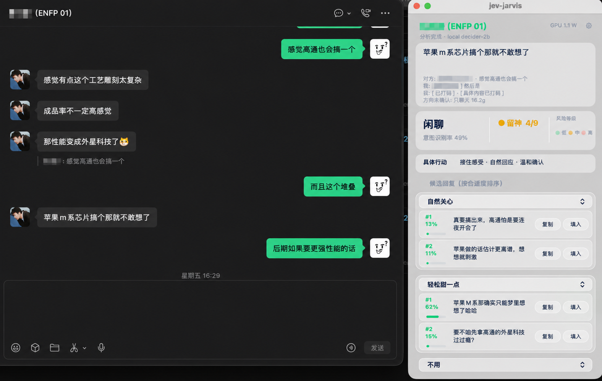

# jev-chat-jarvis（macOS）

微信弹出一条消息 → 悬浮窗告诉你**这句话的意图、风险几级、可以怎么回**。

纯只读、零封号风险：不注入、不 hook、不解密微信数据，只是「看屏幕 + 本地模型判断」；发送永远由用户在微信里手动完成。



## 它能做什么

- **意图 + 风险**：7 类意图（帮忙/问进度/批评/要解释/闲聊/约时间/夸奖）零样本判断 + 风险 0–9 分级 + 行动建议；判断层跑本地 decider-2b（无 key、不出网），异常时自动兜底 laya-coreml。设置可选「通用聊天」或「情侣与暧昧」场景。
- **候选回复**：内置 13 种话术并发生成，每种各出 2 条 → 先上屏 → 本地模型排序后原位重排；关系场景默认「自然关心」+「轻松甜一点」，另可选「认真沟通」。换话术立刻按当前消息重新生成。
- **快**：消息一出现判断 + 生成同时起跑，M1 Pro 出意图 ~1 s、出候选 ~1.5–2 s。
- **YOLO 检测框**（可选，`JEV_BOXES=1`）：OCR 命中的消息实时框在微信窗口上，对方/我分色 + 置信度。
- **功耗读数**：面板右上角一行瓦数，每秒刷新，免 root、不装任何特权组件；读不到的通道不显示数字。

## 从源码跑

前置：macOS + 微信已登录 + 终端授予「屏幕录制」权限（首次启动按提示授权后退出重开）；「填入」另需「辅助功能」权限。首次会自动装 uv/venv 并下载判断模型（约 4 GB）。

```bash
./start.command          # Ctrl+C 退出
```

常用自测命令、架构约束与已知的坑见 [AGENTS.md](AGENTS.md)。离线回归（不读屏、不调 API、不碰真凭据）：

```bash
uv run python -B -m unittest discover -s tests
```

## 配置

判断层完全本地、无需 key。生成层配任意 OpenAI/Anthropic 兼容端点（env 是唯一格式）；也可点悬浮窗齿轮在设置窗里配，保存后重启生效：

```bash
mkdir -p ~/.config/jev-jarvis
cat > ~/.config/jev-jarvis/env <<'ENV'
export OPENAI_API_KEY="sk-你的key"
export OPENAI_BASE_URL="https://api.deepseek.com"
export OPENAI_MODEL="deepseek-chat"
ENV
chmod 600 ~/.config/jev-jarvis/env
```

别用 thinking 模型（思考吃光 `max_tokens`，候选会 0 条）。自查凭据：`uv run python src/generate.py --check`。

## 贡献者

yu.xia、eatmoreduck、shanyazhou、tangtangtang、XinyeYang、baishatang、刘白、Nonnika.Y

## 许可

MIT（见 [LICENSE](LICENSE)）。只读**你自己屏幕上、你自己账号的**聊天内容；装到别人机器上读别人的聊天记录是另一回事，本项目不为那种用法背书。
